  

  

  
  
  
  
  
  

---

### 📊 Impact at a glance

<table align="center">
  <tr>
    <td align="center" width="25%"><h2>55%</h2>faster dataset refresh star-schema rebuild</td>
    <td align="center" width="25%"><h2>200+</h2>users on one certified dataset with Row-Level Security</td>
    <td align="center" width="25%"><h2>40 → 1</h2>duplicate reports replaced single source of truth</td>
    <td align="center" width="25%"><h2>~20 hrs</h2>manual reporting removed / week VBA &amp; Excel → Power BI</td>
  </tr>
</table>

---

### 👨‍💻 About Me

I'm a **Power BI Developer** with **5+ years of experience** in Business Intelligence & Analytics, turning messy, multi-source data into dashboards that leadership teams actually use to make decisions.

- 🔭 Building enterprise-grade BI solutions at **SMART MIND** — previously at **PhysicsWallah**
- 📊 I design star-schema data models, complex **DAX** measures, and automated **ETL** pipelines
- ⚡ My work has cut manual reporting effort by up to **60%** and dashboard refresh times by **~55%**
- 🔐 Hands-on with **Row-Level Security (RLS)**, Power BI Service, and governed report distribution to **200+ users**
- 🎓 **MBA in Business Analytics** · Based in Vadodara, India
- 💬 Ask me about **Power BI, DAX, Power Query, SQL, and dashboard design**

### 🧭 Currently

- 🔎 **Open to** Power BI Developer · BI Developer · Data Analyst roles
- 📍 Vadodara / Ahmedabad · open to relocation and remote
- ⏳ 30-day notice (negotiable)
- 🌱 Going deeper into **Microsoft Fabric** — lakehouses, dataflows and Direct Lake

---

### ▶️ Live dashboards — open them in your browser

| | What you can do |
|---|---|
| **[Sales Team Performance](https://sonimonil.github.io/Sales_Performance/Interactive_Sales_Dashboard.html)** | Slice 6,939 call records by quarter, rep, doctor grade, territory and month |
| **[FNP Festival Seasonality](https://sonimonil.github.io/FNP-Sales-Analysis/FNP_Sales_Dashboard.html)** | 1,000 gifting orders — see the four months that carry 68% of the year |
| **[E-Commerce Consumer Behaviour](https://sonimonil.github.io/Online_Purchase_Counsumer_Behaviour-E-Commerce-/dashboard.html)** | 1,000 respondents, correlation and regression results *(simulated data)* |

---

### 🛠️ Tech Stack

**BI & Visualization**

  
  
  

**Data & Query**

  
  
  
  
  

**Modeling & Ops**

  
  
  
  
  
  

---

### 📌 Featured Projects

| Project | The finding | Tools |
|---------|-------------|-------|
| [💰 Financial Planning & Analysis](https://github.com/sonimonil/Financial-Planning-Analysis) | Enterprise sells below cost — COGS at 103% of net sales. Built in PBIP format, so the model is diffable in Git | Power BI, DAX, Python |
| [📈 Sales Team Performance](https://github.com/sonimonil/Sales_Performance) | 8-rep field force, Q1 → Q2: business +22.4%, call adherence +8.1pp, reconciled from 15 source reports | Excel, BI reporting |
| [🏏 T20 World Cup Analytics](https://github.com/sonimonil/Cricket_Data_Analysis) | Web-scraped player data modelled into batting & bowling facts, custom DAX measures and a data-driven best-XI selection | Power BI, DAX, Python |
| [🎁 FNP Festival Sales](https://github.com/sonimonil/FNP-Sales-Analysis) | Four festival months carry 68% of annual revenue, at a 4.3× multiplier over quiet months | Excel, Python, SVG |
| [🛍️ Retail Sales Analytics](https://github.com/sonimonil/Retail-Sales-Analytics) | Profit per order collapses from ₹270 to ₹7 as discounts deepen; 18.2% YoY growth underneath | SQL, Python, Pandas |
| [🛒 Online Purchase Behaviour](https://github.com/sonimonil/Online_Purchase_Counsumer_Behaviour-E-Commerce-) | Satisfaction and loyalty drive repurchase intention far more than price — tested with ANOVA and regression | Statistics, dashboards |
| [📣 Marketing Analytics](https://github.com/sonimonil/Marketing-Analytics) | Latest campaign hit >60% acceptance in Mexico; web and store outperform every other channel | Python, Power BI |

---

### 📈 GitHub Activity

  

  <picture>
    <source media="(prefers-color-scheme: dark)" srcset="https://raw.githubusercontent.com/sonimonil/sonimonil/output/github-snake-dark.svg" />
    <source media="(prefers-color-scheme: light)" srcset="https://raw.githubusercontent.com/sonimonil/sonimonil/output/github-snake.svg" />
    
  </picture>

---

📫 Reach me at <b>sonimonil247@gmail.com</b> — open to <b>Power BI Developer / BI Developer / Data Analyst</b> roles in Vadodara, Ahmedabad, remote, or relocating.

